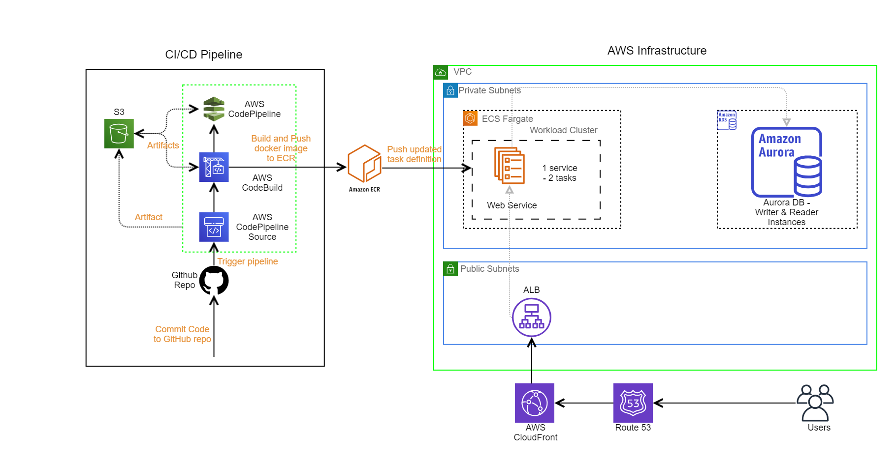

# Devops Wordpress Woocomerce Web App on AWS

## Background -  
The Application Engineering team has been developing a custom WooCommerce-based product which will need to be deployed for this initiative. As a member of the Site Reliability Engineering team your job will be to create the cloud-based infrastructure for supporting this deployment. You will need to create a reference architecture and implement it using modern IaC techniques.

## Solution - 

URL - http://wordpress-2071899879.us-east-1.elb.amazonaws.com/

There are 3 major sections in this repo -

1) infra-terraform directory - contains terraform code for deploying the AWS Infrastructure.

2) new-wordpress-docker-compose - contains locally tested wordpress app in folder new-wordpress-docker-compose - For Wordpress, MySQL & phpmyadmin.

3) Other files in root - contains dockerfile and buildspec to create the build image in Codebuild and push it onto the containers running in Fargate Cluster.

How this works - Any push into the master triggers the codepipeline in AWS and dedploys the newly built image onto the fargate cluster.
